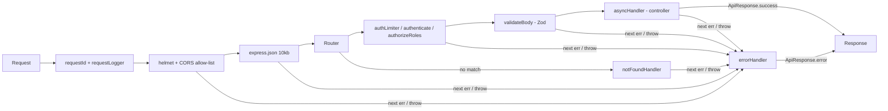

# System Design & Architecture Decisions

## Contents

1. [Folder Structure Pattern](#1-folder-structure-pattern)
2. [Response Standard](#2-response-standard)
3. [Request Pipeline](#3-request-pipeline)
4. [The `@restful/shared` Package](#4-the-restfulshared-package)
5. [Architecture Decision Records](#5-architecture-decision-records)

---

## 1. Folder Structure Pattern

Beginner demos (Days 1–25) grew this layout step by step. From Day 26 onward, every demo follows it, and new days start from [`demos/_template`](../../demos/_template/README.md):

```bash
day_XX/
├── prisma/schema.prisma   # DB schema (Postgres demos); client generated to ../generated/prisma
├── src/
│   ├── index.ts           # Entry point — only connects and calls listen()
│   ├── app.ts             # Express app: request id/log → security → parsers → routes → 404 → errors
│   ├── config/            # Environment loading; required secrets fail fast
│   ├── controllers/       # Thin request handlers — business logic, throw AppError
│   ├── routes/            # Route definitions: validateBody(...) + asyncHandler(...)
│   ├── validators/        # Zod schemas = the whitelist of client-settable fields
│   ├── middleware/        # Demo-specific middleware (auth, RBAC, rate limiting)
│   ├── services/          # Logic shared by several controllers (e.g. token.service.ts)
│   ├── docs/              # OpenAPI document generated from validators (Day 29)
│   ├── lib/prisma.ts      # PrismaClient singleton
│   ├── models/            # Mongoose models (MongoDB demos)
│   └── __tests__/         # Jest + Supertest, database mocked
├── .env.example           # Every variable the demo reads — never real values
└── docker-compose.yml     # Local database, credentials from .env
```

A full service/repository split for every resource arrives with the Repository + Service Layer lesson (Day 37). Until then, `services/` only holds logic that several handlers share.

---

## 2. Response Standard

Every response from Day 20 onward uses one envelope, produced by `ApiResponse` in `@restful/shared`:

```ts
// Success
{
  success: true;
  message: string;
  data: T;
  timestamp: string;   // ISO 8601
}

// Error — also used for 404s, validation failures and unexpected crashes
{
  success: false;
  message: string;     // safe to show to clients; 500s are always "Internal Server Error"
  errors: unknown;     // field errors for 400 validation failures, otherwise null
  timestamp: string;
}
```

Status code mapping (`normalizeError` in `shared/src/error-handler.ts`):

| Source | Status |
|---|---|
| `AppError(message, status)` thrown by a controller/middleware | `status` |
| Zod validation failure (`validateBody`) | 400 + field errors |
| Malformed JSON / body over size limit | 400 / 413 |
| Prisma `P2002` (unique constraint) | 409 |
| Prisma `P2025` (record not found) | 404 |
| Mongoose `CastError` (bad ObjectId) / `ValidationError` | 400 |
| No route matched | 404 |
| Anything else | 500 — real message logged, never sent |

---

## 3. Request Pipeline



Middleware order in `app.ts` matters. `notFoundHandler` and `errorHandler` must be registered **after** every route, or they run before the routes they are meant to catch.

---

## 4. The `@restful/shared` Package

| Export | Purpose |
|---|---|
| `ApiResponse` | The response envelope (Section 2) |
| `AppError` | An expected error with a status code and client-safe message |
| `asyncHandler` | Wraps async handlers so rejected promises reach `errorHandler` (Express 4 doesn't do this) |
| `errorHandler`, `notFoundHandler`, `normalizeError` | Global error handling (Section 2 mapping) |
| `validateBody(schema)` | Validates and **replaces** `req.body` with the parsed result; unknown keys are stripped |
| `AuthUser`, `isAuthUser` | JWT payload type + runtime guard; importing the package types `req.user` and `req.id` |
| `logger` | Winston logger: JSON in production, readable in development, silent in tests (unless `LOG_LEVEL`) |
| `requestId`, `requestLogger` | `X-Request-Id` on every response (reuses a safe incoming id) + one log line per request with status and duration |

Used by Days 26–30 and `demos/_template`. Day 30's original hand-written middleware is documented in `docs/progress/day_30_reflection.md`; the code now uses the shared version so only one implementation exists.

---

## 5. Architecture Decision Records

Each record is short: what was decided, why, and what it costs.

### ADR-001 — One response envelope and one error handler

- **Decision:** All demos answer through `ApiResponse` and a single global `errorHandler`. Controllers `throw new AppError(...)` instead of writing error responses themselves.
- **Why:** Before this, Days 26–27 had no error handler. A thrown error returned Express's HTML error page, and an unhandled rejection could crash the process. One handler also guarantees that a 500 never leaks internal messages.
- **Cost:** Status-mapping rules live in one place (`normalizeError`). A new error source, e.g. Redis, needs a rule there.

### ADR-002 — `@restful/shared` is a built package, not path aliases

- **Decision:** `shared/` is a workspace package (`@restful/shared`) compiled to `dist/` with type declarations. Demos depend on it as `workspace:*`. `pnpm install` builds it through its `prepare` script.
- **Why:**
  - Demos keep their own `rootDir: ./src`, so `tsc` builds them unchanged.
  - Runtime, ts-node and Jest all resolve it as a normal Node module.
  - The `req.user` type augmentation travels with the package.
- **Cost:** After editing `shared/src`, run `pnpm --filter @restful/shared build`, or reinstall, before the demos see the change.

### ADR-003 — Prisma client generated per demo

- **Decision:** Every Prisma schema sets `output = "../generated/prisma"`. Code imports the client only from `src/lib/prisma.ts`, never from `@prisma/client`.
- **Why:** In a pnpm workspace, all demos share one installed copy of `@prisma/client`. Each demo has a different schema (Day 27 has `age`, Day 29 has `MODERATOR`). With the default output, each `prisma generate` overwrote the others' client and types.
- **Cost:** `generated/` is git-ignored and created by each demo's `postinstall`. A fresh clone needs `pnpm install` before it type-checks.

### ADR-004 — A PrismaClient singleton per process

- **Decision:** `src/lib/prisma.ts` creates the only `PrismaClient`. Everything imports it.
- **Why:** Each `new PrismaClient()` opens its own connection pool. Day 29 used to create two. A single module also gives tests one place to mock (`jest.mock('../lib/prisma')`).
- **Cost:** None worth noting.

### ADR-005 — Zod schemas are the field whitelist

- **Decision:** Every request body goes through `validateBody(schema)` before the controller runs. Controllers trust `req.body` only after validation.
- **Why:** Schemas strip unknown keys, which closes mass-assignment bugs. Day 27 accepted `role` from clients, and Day 29 originally did too. Schemas also normalise input (trimmed, lowercased emails) and return field-level 400s.
- **Cost:** A new field must be added to the schema before clients can set it. That is intended.

### ADR-006 — Secrets are required, never defaulted

- **Decision:** Secrets such as `JWT_SECRET` are read with `requireEnv()`, and the app refuses to start without them. `.env` is git-ignored. `.env.example` documents every variable with placeholder values. docker-compose reads database credentials from `.env`.
- **Why:** A fallback secret committed to git means any deployment that forgets the variable signs tokens with a public key.
- **Cost:** Tests set the secret in `jest.setup.js`, and a fresh checkout needs `cp .env.example .env`.

### ADR-007 — Beginner demos stay standalone

- **Decision:** Days 1–25 keep their own copies of utilities and are not migrated to `@restful/shared`. They are still type-checked in CI but excluded from ESLint. (Day 30 was migrated: its lesson is captured in its reflection doc.)
- **Why:** They are lesson snapshots. Rewriting them would erase the progression the challenge documents.
- **Cost:** Duplicate `ApiResponse` copies remain in the beginner folder.

### ADR-008 — Two test layers: mocked unit/integration tests + a real-database smoke test

- **Decision:** Jest + Supertest tests mock the Prisma singleton or Mongoose model methods; CI enforces coverage thresholds of 80% for `shared`, 70% for demos. Separately, `scripts/smoke-test.sh` (`pnpm smoke`) runs every intermediate demo against throwaway Postgres + MongoDB containers with the real migrations, as its own CI job.
- **Why:** The Jest layer is fast and deterministic. The smoke layer catches what mocks can't: migrations, constraints (P2002), cascades, real query behaviour.
- **Cost:** The smoke job needs Docker and takes a couple of minutes, so it runs once (Node 22) after the matrix job passes.

### ADR-009 — Short access tokens + rotating, hashed refresh tokens

- **Decision:** Access JWTs live 15 minutes. Login also returns an opaque refresh token (48 random bytes), stored only as a SHA-256 hash, valid 7 days. Each `/refresh` revokes the presented token and links it to its replacement. Presenting an already-revoked token revokes **every** active token of that user. Rotation uses a conditional update inside a transaction so two parallel refreshes can't both succeed.
- **Why:** A stolen access token is useful for minutes, not a day. Hashing means a database leak doesn't yield usable tokens. Reuse detection turns refresh-token theft into a forced logout instead of silent persistent access.
- **Cost:** One extra table and a DB round-trip per refresh. Access tokens can't be revoked before they expire (accepted: max 15 minutes). The role is re-read on refresh, so role changes apply within 15 minutes.

### ADR-010 — OpenAPI generated from the Zod validators

- **Decision:** Day 29 builds its OpenAPI 3.1 document with `@asteasolutions/zod-to-openapi` from the same schemas used by `validateBody`, served at `/api/docs/openapi.json` with Swagger UI at `/api/docs`.
- **Why:** Hand-written specs drift. Here, a field added to a validator appears in the docs automatically, and a test checks that every route is documented and that `role` is not in the register body.
- **Cost:** Response shapes are still declared by hand in `src/docs/openapi.ts`.
