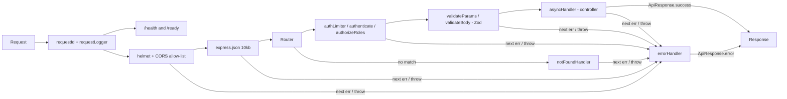

# System Design & Architecture Decisions

## Contents

1. [Folder Structure Pattern](#1-folder-structure-pattern)
2. [Response Standard](#2-response-standard)
3. [Request Pipeline](#3-request-pipeline)
4. [The `@restful/shared` Package](#4-the-restfulshared-package)
5. [Architecture Decision Records](#5-architecture-decision-records)

---

## 1. Folder Structure Pattern

Beginner demos (Days 1–25) grew this layout step by step. From Day 26 onward, every demo follows it, and new days start from [`demos/_template`](../../demos/_template/README.md):

```bash
day_XX/
├── prisma/schema.prisma   # DB schema (Postgres demos); client generated to ../generated/prisma
├── src/
│   ├── index.ts           # Entry point — only connects and calls listen()
│   ├── app.ts             # Express app: request id/log → security → parsers → routes → 404 → errors
│   ├── config/            # Environment loading; required secrets fail fast
│   ├── controllers/       # Thin request handlers — business logic, throw AppError
│   ├── routes/            # Route definitions: validateBody(...) + asyncHandler(...)
│   ├── validators/        # Zod schemas = the whitelist of client-settable fields
│   ├── middleware/        # Demo-specific middleware (auth, RBAC, rate limiting)
│   ├── services/          # Logic shared by several controllers (e.g. token.service.ts)
│   ├── docs/              # OpenAPI document generated from validators (Day 29)
│   ├── lib/prisma.ts      # PrismaClient singleton
│   ├── models/            # Mongoose models (MongoDB demos)
│   └── __tests__/         # Jest + Supertest, database mocked
├── .env.example           # Every variable the demo reads — never real values
└── docker-compose.yml     # Local database, credentials from .env
```

A full service/repository split for every resource arrives with the Repository + Service Layer lesson (Day 37). Until then, `services/` only holds logic that several handlers share.

---

## 2. Response Standard

Every response from Day 20 onward uses one envelope, produced by `ApiResponse` in `@restful/shared`:

```ts
// Success
{
  success: true;
  message: string;
  data: T;
  timestamp: string;   // ISO 8601
}

// Error — also used for 404s, validation failures and unexpected crashes
{
  success: false;
  message: string;     // safe to show to clients; 500s are always "Internal Server Error"
  errors: unknown;     // field errors for 400 validation failures, otherwise null
  timestamp: string;
}
```

Status code mapping (`normalizeError` in `shared/src/error-handler.ts`):

| Source | Status |
|---|---|
| `AppError(message, status)` thrown by a controller/middleware | `status` |
| Zod validation failure (`validateBody`) | 400 + field errors |
| Malformed JSON / body over size limit | 400 / 413 |
| Prisma `P2002` (unique constraint) | 409 |
| Prisma `P2025` (record not found) | 404 |
| Mongoose `CastError` (bad ObjectId) / `ValidationError` | 400 |
| No route matched | 404 |
| Anything else | 500 — real message logged, never sent |

---

## 3. Request Pipeline



Middleware order in `app.ts` matters. `notFoundHandler` and `errorHandler` must be registered **after** every route, or they run before the routes they are meant to catch.

---

## 4. The `@restful/shared` Package

| Export | Purpose |
|---|---|
| `ApiResponse` | The response envelope (Section 2) |
| `AppError` | An expected error with a status code and client-safe message |
| `asyncHandler` | Wraps async handlers so rejected promises reach `errorHandler` (Express 4 doesn't do this) |
| `errorHandler`, `notFoundHandler`, `normalizeError` | Global error handling (Section 2 mapping) |
| `validateBody` / `validateQuery` / `validateParams` | Validate and **replace** `req.body` / `req.query` / `req.params` with the parsed result; unknown keys stripped, 400 + field errors on failure |
| `AuthUser`, `isAuthUser` | JWT payload type + runtime guard; importing the package types `req.user` and `req.id` |
| `logger` | Winston logger: JSON in production, readable in development, silent in tests (unless `LOG_LEVEL`) |
| `healthRouter(checks)` | `GET /health` (liveness) and `GET /ready` (runs each check with a timeout; 503 naming the failing dependency) |
| `startServer(app, options)` | `listen()` + SIGTERM/SIGINT handling: stop accepting, drain in-flight requests, run `onShutdown` hooks (e.g. `prisma.$disconnect()`), exit; forced exit after a timeout |
| `requestId`, `requestLogger` | `X-Request-Id` on every response (reuses a safe incoming id) + one log line per request with status and duration |
| `createApiRegistry`, `generateOpenApiDocument`, `docsRouter`, `jsonContent`, `successEnvelope` | Document a demo's API from its Zod schemas; serve `/api/docs` + `/api/docs/openapi.json` |
| `offsetPaginationQuery`, `cursorPaginationQuery`, `paginateOffset`, `paginateCursor`, `encodeCursor`/`decodeCursor` | Offset and keyset pagination with consistent `meta` |
| `loadEnv`, `envFields` | Validate the whole environment with one Zod schema at startup; reusable field types (port, csv, flag, secret) |
| `@restful/shared/testing` → `createContractMatcher` | Test helper: assert a response matches the OpenAPI document (closed objects, documented status) |

Used by Days 26–30 and `demos/_template`. Day 30's original hand-written middleware is documented in `docs/progress/day_30_reflection.md`; the code now uses the shared version so only one implementation exists.

---

## 5. Architecture Decision Records

Each record is short: what was decided, why, and what it costs.

### ADR-001 — One response envelope and one error handler

- **Decision:** All demos answer through `ApiResponse` and a single global `errorHandler`. Controllers `throw new AppError(...)` instead of writing error responses themselves.
- **Why:** Before this, Days 26–27 had no error handler. A thrown error returned Express's HTML error page, and an unhandled rejection could crash the process. One handler also guarantees that a 500 never leaks internal messages.
- **Cost:** Status-mapping rules live in one place (`normalizeError`). A new error source, e.g. Redis, needs a rule there.

### ADR-002 — `@restful/shared` is a built package, not path aliases

- **Decision:** `shared/` is a workspace package (`@restful/shared`) compiled to `dist/` with type declarations. Demos depend on it as `workspace:*`. `pnpm install` builds it through its `prepare` script.
- **Why:**
  - Demos keep their own `rootDir: ./src`, so `tsc` builds them unchanged.
  - Runtime, ts-node and Jest all resolve it as a normal Node module.
  - The `req.user` type augmentation travels with the package.
- **Cost:** After editing `shared/src`, run `pnpm --filter @restful/shared build`, or reinstall, before the demos see the change.

### ADR-003 — Prisma client generated per demo

- **Decision:** Every Prisma schema sets `output = "../generated/prisma"`. Code imports the client only from `src/lib/prisma.ts`, never from `@prisma/client`.
- **Why:** In a pnpm workspace, all demos share one installed copy of `@prisma/client`. Each demo has a different schema (Day 27 has `age`, Day 29 has `MODERATOR`). With the default output, each `prisma generate` overwrote the others' client and types.
- **Cost:** `generated/` is git-ignored and created by each demo's `postinstall`. A fresh clone needs `pnpm install` before it type-checks.

### ADR-004 — A PrismaClient singleton per process

- **Decision:** `src/lib/prisma.ts` creates the only `PrismaClient`. Everything imports it.
- **Why:** Each `new PrismaClient()` opens its own connection pool. Day 29 used to create two. A single module also gives tests one place to mock (`jest.mock('../lib/prisma')`).
- **Cost:** None worth noting.

### ADR-005 — Zod schemas are the field whitelist

- **Decision:** Every request body goes through `validateBody(schema)` before the controller runs. Controllers trust `req.body` only after validation.
- **Why:** Schemas strip unknown keys, which closes mass-assignment bugs. Day 27 accepted `role` from clients, and Day 29 originally did too. Schemas also normalise input (trimmed, lowercased emails) and return field-level 400s.
- **Cost:** A new field must be added to the schema before clients can set it. That is intended.

### ADR-006 — Secrets are required, never defaulted

- **Decision:** Secrets such as `JWT_SECRET` are read with `requireEnv()`, and the app refuses to start without them. `.env` is git-ignored. `.env.example` documents every variable with placeholder values. docker-compose reads database credentials from `.env`.
- **Why:** A fallback secret committed to git means any deployment that forgets the variable signs tokens with a public key.
- **Cost:** Tests set the secret in `jest.setup.js`, and a fresh checkout needs `cp .env.example .env`.

### ADR-007 — Beginner demos stay standalone

- **Decision:** Days 1–25 keep their own copies of utilities and are not migrated to `@restful/shared`. They are still type-checked in CI but excluded from ESLint. (Day 30 was migrated: its lesson is captured in its reflection doc.)
- **Why:** They are lesson snapshots. Rewriting them would erase the progression the challenge documents.
- **Cost:** Duplicate `ApiResponse` copies remain in the beginner folder.

### ADR-008 — Two test layers: mocked unit/integration tests + a real-database smoke test

- **Decision:** Jest + Supertest tests mock the Prisma singleton or Mongoose model methods; CI enforces coverage thresholds of 80% for `shared`, 70% for demos. Separately, `scripts/smoke-test.sh` (`pnpm smoke`) runs every intermediate demo against throwaway Postgres + MongoDB containers with the real migrations, as its own CI job.
- **Why:** The Jest layer is fast and deterministic. The smoke layer catches what mocks can't: migrations, constraints (P2002), cascades, real query behaviour.
- **Cost:** The smoke job needs Docker and takes a couple of minutes, so it runs once (Node 22) after the matrix job passes.

### ADR-009 — Short access tokens + rotating, hashed refresh tokens

- **Decision:** Access JWTs live 15 minutes. Login also returns an opaque refresh token (48 random bytes), stored only as a SHA-256 hash, valid 7 days. Each `/refresh` revokes the presented token and links it to its replacement. Presenting an already-revoked token revokes **every** active token of that user. Rotation uses a conditional update inside a transaction so two parallel refreshes can't both succeed.
- **Why:** A stolen access token is useful for minutes, not a day. Hashing means a database leak doesn't yield usable tokens. Reuse detection turns refresh-token theft into a forced logout instead of silent persistent access.
- **Cost:** One extra table and a DB round-trip per refresh. Access tokens can't be revoked before they expire (accepted: max 15 minutes). The role is re-read on refresh, so role changes apply within 15 minutes.

### ADR-010 — OpenAPI generated from the Zod validators

- **Decision:** Day 29 builds its OpenAPI 3.1 document with `@asteasolutions/zod-to-openapi` from the same schemas used by `validateBody`, served at `/api/docs/openapi.json` with Swagger UI at `/api/docs`.
- **Why:** Hand-written specs drift. Here, a field added to a validator appears in the docs automatically, and a test checks that every route is documented and that `role` is not in the register body.
- **Cost:** Response shapes are still declared by hand in `src/docs/openapi.ts`.

### ADR-011 — Health probes and graceful shutdown in every demo

- **Decision:** Every app mounts `healthRouter`. `/health` never touches dependencies; `/ready` pings the database (`SELECT 1` / Mongo `ping`) with a 2-second timeout. Entry points use `startServer`. On SIGTERM/SIGINT it stops accepting connections, closes idle keep-alive sockets, waits for in-flight requests, disconnects the database, and exits 0. It forces exit 1 after 10 seconds.
- **Why:** Docker, Kubernetes and load balancers need a separate liveness and readiness signal. Without a graceful shutdown, every restart or deploy cuts off requests and leaves connections open on the database.
- **Cost:** Probe requests appear in the request log at `debug` level only. The smoke test checks both probes and a real SIGTERM exit code for every demo.

### ADR-012 — Two layers of login throttling

- **Decision:** Auth routes keep the per-IP limiter (`AUTH_RATE_LIMIT`). `/login` also has a per-account limiter keyed on the normalised email (`LOGIN_ACCOUNT_LIMIT`, default 5 per 15 minutes), which counts **failed** logins only.
- **Why:** Credential stuffing spreads attempts across many IPs, so a per-IP limit alone doesn't slow guessing against one account. Counting only failures means the real user's successful logins never lock them out.
- **Cost:** Anyone who knows an email can lock that account for up to 15 minutes by failing logins (a nuisance-level denial of service). This is accepted for a demo. Production systems usually add CAPTCHA or step-up verification instead of a hard block.

### ADR-013 — Spec-first contracts and committed generated clients

- **Decision:** From Day 31, a demo's contract (Zod schemas + documented operations) is written first. Validation, the OpenAPI document and a typed client (`openapi-typescript` + `openapi-fetch`) are generated from it. The generated `openapi.json` and client types are committed, and a drift check fails when they're stale.
- **Why:** Consumers can review and diff the contract in pull requests, and the compiler catches client/API mismatches.
- **Cost:** Regenerate (`pnpm openapi:generate`) after changing the contract. Generated files are excluded from Prettier so they stay byte-identical to the generator output.

### ADR-014 — Two pagination styles, chosen per endpoint

- **Decision:** Offset pagination (`page`, `pageSize`) for searchable lists that need page numbers. Cursor (keyset) pagination for feeds, with opaque cursors over a unique sort key `(createdAt, id)`. Sorting is always a whitelist with an `id` tie-breaker.
- **Why:** Offset is simple but slows down and shifts under writes; keyset stays fast and stable but only goes forward.
- **Cost:** Two code paths. Cursors must be validated: a malformed one is a 400, not a 500.

### ADR-015 — Redis as an optional cache (cache-aside)

- **Decision:** Reads use cache-aside with a TTL. Writes go to the database first, then invalidate the item key and bump a list version. Redis failures degrade to `X-Cache: BYPASS` instead of errors, and readiness doesn't depend on Redis.
- **Why:** The cache only exists for speed. Losing it must never lose correctness or availability.
- **Cost:** A short staleness window is possible if an invalidation fails; the TTL bounds it.

### ADR-016 — Deterministic, idempotent seeds

- **Decision:** Seed data is static (no random values or "now"), upserted on natural keys, organised in profiles, and covered by a snapshot test.
- **Why:** The same database in every environment, and seeds that are safe to re-run at any time.
- **Cost:** Every seeded table needs a natural unique key.

### ADR-017 — Service and repository layers with injected dependencies

- **Decision:** Where business rules exist (Day 37+), controllers call services, and services depend on repository interfaces. Apps are built with `createApp(dependencies)`, and `index.ts` is the only composition root.
- **Why:** Rules are testable without a database (in-memory repository, injected clock), and storage can change without touching the rules.
- **Cost:** More files per feature. Simple CRUD demos may skip the layers.

### ADR-018 — Responses are DTOs built by mappers

- **Decision:** Entities never leave the API directly. Mappers build each DTO field by field, one per audience (public, private, admin).
- **Why:** A column added to a table stays private until someone decides which view exposes it.
- **Cost:** Each new response field must be added to a mapper (intentionally).

### ADR-019 — Refresh tokens in httpOnly cookies with double-submit CSRF

- **Decision:** In browser-facing auth (Day 43), the refresh token lives in an `httpOnly; SameSite=Strict; Path=/api/auth` cookie. Cookie-authenticated endpoints require an `X-CSRF-Token` header that matches a readable `csrf_token` cookie. Each login is a named session that survives rotation and can be listed or revoked.
- **Why:** XSS can't read the refresh token, cross-site requests can't use it, and users can sign out lost devices.
- **Cost:** CORS needs explicit origins with `credentials: true`, and clients must echo the CSRF cookie.

### ADR-020 — Real-database integration tests with Testcontainers

- **Decision:** Database-dependent behaviour (constraints, Postgres-specific types and indexes) is tested against a disposable PostgreSQL started by Testcontainers. This is a separate `test:integration` suite that runs in the CI `smoke` job.
- **Why:** Mocks can't prove that a constraint, an index or an array query behaves as expected.
- **Cost:** Needs Docker and takes longer, so it runs apart from the fast unit suite.

### ADR-021 — One Dockerfile for every demo

- **Decision:** `docker/demo.Dockerfile` builds any workspace package (`--build-arg PACKAGE=…`). It uses a multi-stage build, `pnpm deploy --prod`, a non-root `node` user and a `/health` HEALTHCHECK. Compose runs migrations as a one-off job, and the API waits for it and reports readiness with `/ready`.
- **Why:** Small, reproducible images; migrations never race app replicas; `docker stop` triggers the graceful shutdown from ADR-011.
- **Cost:** Each containerised demo lists its runtime files (`"files"`) and needs the Prisma CLI as a runtime dependency.

### ADR-022 — Layered, validated environment configuration

- **Decision:** `.env.<env>.local` → `.env.local` → `.env.<env>` → `.env`, with real environment variables winning. Per-environment defaults are committed; secrets never are. One Zod schema validates everything at startup, including production-only rules, and the app receives a typed config object.
- **Why:** Misconfiguration fails at boot with a complete list, and nothing reads `process.env` after startup.
- **Cost:** Every new setting is added to the schema and `.env.example`.
