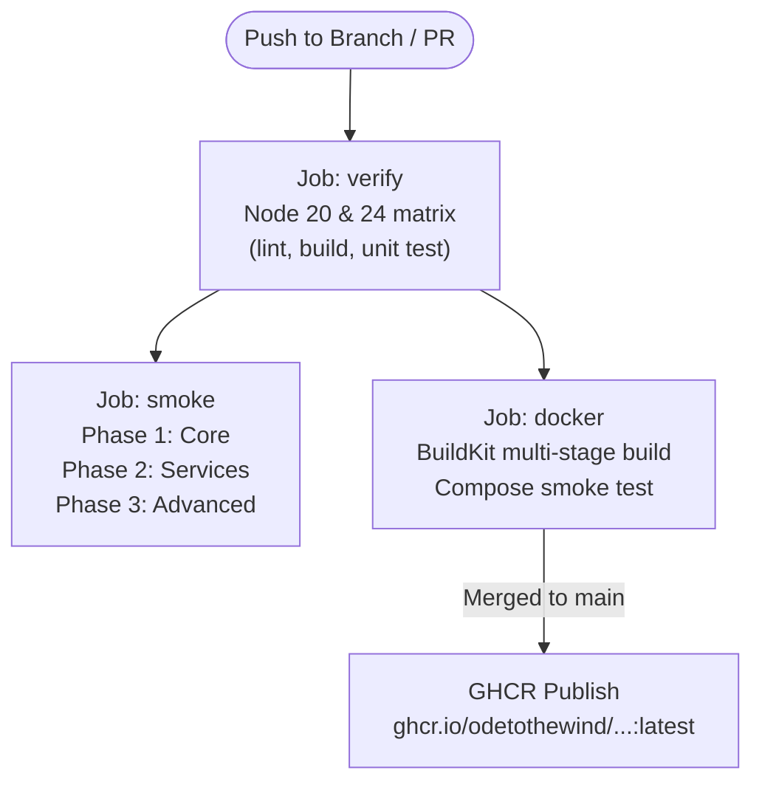

# Day 47 - Hardened GitHub Actions CI/CD Pipeline & GHCR Publishing

**Level**: Intermediate  
**Date**: October 8, 2026  
**Status**: ✅ Completed

## Objective
Engineer a robust, **hardened GitHub Actions CI/CD pipeline** with least-privilege permissions, auto-canceling concurrency, automated test coverage reporting in job summaries, modular real-infrastructure smoke test phases, and automated Docker image publishing to GitHub Container Registry (`ghcr.io`).

## Key Learnings
- **Stale Run Cancellation via Concurrency**: Adding a concurrency group keyed on `github.workflow` and `github.ref` with `cancel-in-progress: true` automatically aborts obsolete workflow runs when rapid commits are pushed, saving CI runner minutes.
- **Least-Privilege Security Posture**: Specifying `permissions: contents: read` globally prevents compromised dependencies or malicious pull requests from tampering with repository tags, releases, or settings. Write permissions (`packages: write`) are strictly confined to the Docker publish step on `main`.
- **Defensive Timeouts & Matrix Independence**: Adding `timeout-minutes: 15` prevents hanging jobs from consuming CI runner quotas. Setting `fail-fast: false` in the Node 20 and Node 24 matrix ensures failures on one Node version don't mask test results on the other.
- **Job Summary Coverage Tables**: Authoring `scripts/coverage-summary.mjs` parses Jest's `json-summary` output and generates a clean GitHub-flavored Markdown table appended to `$GITHUB_STEP_SUMMARY`, offering immediate visibility into code coverage without leaving GitHub.
- **Modular Smoke Test Phases**: Splitting the smoke test suite into dedicated phases (Phase 1: Core Days 26–33, Phase 2: Services Days 34–43, Phase 3: Advanced Days 44–50) allows failures to be isolated immediately to specific functional domains.
- **Automated Container Registry Publishing**: When code merges into `main`, the `docker` job logs into `ghcr.io`, tags the Day 46 production image with both commit SHA and `latest`, and pushes it to GitHub Container Registry.

## Tech Stack Used
- **GitHub Actions** (Workflow orchestration)
- **docker/build-push-action** + **Docker Buildx** (GHA cache backends)
- **GitHub Container Registry (`ghcr.io`)**
- **Node.js** + **pnpm**
- **Jest Coverage Reporters**

## Project Structure (Day 47)
```bash
day_47_ci_hardening/
├── .github/workflows/
│   └── ci-cd.yml                # Hardened pipeline (verify, smoke phases, docker, publish)
├── scripts/
│   ├── coverage-summary.mjs     # Generates markdown coverage tables for GitHub Actions
│   └── smoke/
│       ├── common.sh            # Reusable health probe and assertion utilities
│       ├── phase-1-core.sh      # Days 26–33 smoke assertions
│       ├── phase-2-services.sh  # Days 34–43 smoke assertions
│       └── phase-3-advanced.sh  # Days 44–50 smoke assertions
└── package.json
```

## Pipeline Architecture Overview



## How to Run & Verify

```bash
# Generate local coverage summary identical to GitHub Actions summary
pnpm test:coverage
node scripts/coverage-summary.mjs

# Execute split smoke phases against local test containers
./scripts/smoke/phase-1-core.sh
./scripts/smoke/phase-2-services.sh
./scripts/smoke/phase-3-advanced.sh
```

### Challenges Faced & Solved
- **Docker Compose Rebuilding Overhead in CI**: Buildx builds the production image using GitHub Actions cache (`type=gha`). Running `docker compose up --no-build` ensures Docker Compose uses the pre-built image rather than attempting to rebuild from scratch without Buildx cache layers.
- **Container Registry Naming Constraints**: GitHub repository names can have capital letters (`OdeToTheWind`), but Docker image registries strictly enforce lowercase repository naming. I added a shell conversion step (`REPO_LOWER=$(echo "${{ github.repository }}" | tr '[:upper:]' '[:lower:]')`) to eliminate publishing errors.
- **YAML Formatting Quirk in Action Step Names**: Step titles with colons (e.g., `Smoke test — Phase 1: Core`) caused YAML parser errors because colons denote key-value mappings. Enclosing step names in quotes resolved the syntax issue.

### Next Steps
- Model one-to-many and many-to-many database relationships in Prisma while uncovering the N+1 query problem in Day 48.

---

**Status: ✅ Day 47 Successfully Completed**  
**Progress: 47/100 Days**  
**Milestone: Hardened enterprise CI/CD pipeline built with least-privilege security, modular smoke phases, and GHCR container publishing.**
